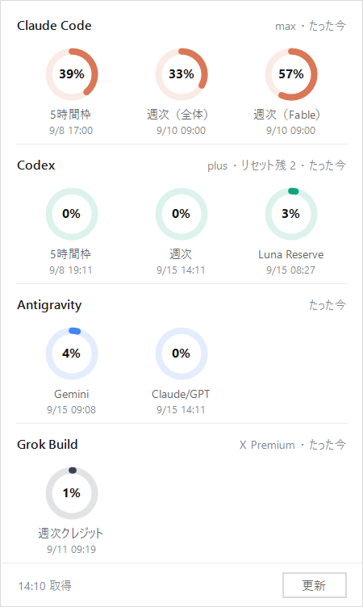

# QuotaGauge

[English](README.md) ・ 日本語

Claude Code と Codex の**利用枠の残りをタスクトレイから確認する**Windows用の常駐ツール。

exe 1つで動く。インストーラも .NET ランタイムの追加も要らない。

> **どちらも、それぞれの CLI 自身に聞く。**
> 認証情報ファイルに触れず、第三者のサーバーへは何も送らない。設定も要らない。

---

## できること

| 操作 | |
|---|---|
| **アイコン** | 一番厳しい枠の使用率をリングで表示。90%以上は赤、70%以上は橙 |
| **左クリック** | Claude と Codex の枠を一覧するパネルが開く |
| **カーソルを乗せる** | それぞれの使用率が出る |
| **右クリック** | 今すぐ更新／アイコンに出す対象／Claude の取得元／ログ／Windows起動時に開始／終了 |

左クリックで開くパネル：



3分ごとに自動更新する。5時間枠・週次に加えて、**モデル別の週次枠**（`週次（Fable）`）とプラン名まで出る。

**アイコンがどちらを映すかは選べる。** 右クリック →「アイコンに出す対象」から、
`厳しい方`（既定）／`Claude Code`／`Codex` のどれかを選ぶ。主に使うツールは人によって違うので、
Codex がメインなら Codex だけを映すようにできる。

## インストール

1. [Releases](../../releases) から `QuotaGauge.exe` をダウンロードして、好きなフォルダに置く
   - 署名していないので、**Releases に載せた SHA256 と突き合わせて確認できる**：
     `Get-FileHash .\QuotaGauge.exe`
2. ダブルクリックで起動する
   - **署名していない exe なので、Windows SmartScreen が「WindowsによってPCが保護されました」を出す。**
     `詳細情報` → `実行` で進む。気になる場合は下の[ビルド](#ビルド)から自分でコンパイルする（数秒で終わる）
3. **アイコンが `^`（隠れているインジケーター）の中にいたら、タスクバーの見える位置へドラッグする**
   （Windows 11 は新しいトレイアイコンを必ず最初にそこへ入れる）
4. 右クリック →「Windows起動時に開始」をON

セットアップはこれだけ。`claude` と `codex` がそれぞれ PATH にあってログイン済みなら、そのまま動く。

## 仕組み

**どちらも「CLI 自身に、あなたの利用枠を教えて」と聞いているだけ。** 自分で認証情報を読んだり、
API を叩いたりはしない。トークンの更新も各 CLI がやるので、期限切れで止まることがない。

### Claude Code

`claude` を stream-json モードで起動し、control request を1行流す。

```
{"type":"control_request","request_id":"1","request":{"subtype":"get_usage"}}
```

返ってくる `rate_limits.limits[]` から `kind` / `percent` / `resets_at` / `scope` を読む。
`subscription_type`（`max` など）も一緒に来るので、パネルの見出しに出している。

このリクエストは Claude Code 本体の `/usage` と同じデータを返す。**モデルは呼ばれないので課金されない**
（実測で `total_cost_usd: 0` / `model_usage: {}` / `total_api_duration_ms: 0`）。

> ⚠️ **`get_usage` は実験的なインターフェース。**
> Claude Code のスキーマにも `Experimental — the response shape may change` と書かれており、
> SDK 側のメソッド名は `usage_EXPERIMENTAL_MAY_CHANGE_DO_NOT_RELY_ON_THIS_API_YET()`。
> 将来かたちが変わって動かなくなる可能性がある。

起動に**7〜10秒**かかる（実測。MCP と hook は読み込まないよう指定して 16.6秒から短縮した）。
取得はバックグラウンドで走るので、画面が固まることはない。

### Codex

`codex app-server` の JSON-RPC を呼ぶ。

```
initialize
account/rateLimits/read
```

このメソッドは `codex app-server generate-json-schema` が出力する**公式スキーマに定義されている**もの。
レスポンスの `rateLimits.primary` / `secondary` から `usedPercent` / `resetsAt` / `windowDurationMins` を読む。
こちらは1秒ほどで返る。

> Codex CLI に telegram プラグインが入っている環境向けに、app-server を呼ぶときは
> `TELEGRAM_STATE_DIR` を一時ディレクトリへ逃がしている（常駐中のポーラーを止めさせないため）。

<a id="claude-source"></a>

### Claude の取得元は切り替えられる

右クリック →「Claude の取得元」。**通常は既定のままでよい。**

| | ① Claude Code に聞く（既定） | ② 同じ問い合わせ先を直接 | ③ ステータスライン経由 |
|---|---|---|---|
| 事前の設定 | 要らない | 要らない | **必要**（下記） |
| 認証情報 | **触れない** | `.credentials.json` を読む | **触れない** |
| トークン期限切れ | **自動更新される** | **401 で止まる** | 影響なし |
| モデル別の枠 | **出る** | **出る** | 出ない |
| 値の鮮度 | **常に最新** | **常に最新** | 呼ばれた時点のまま |
| 所要 | 7〜10秒 | ネットワーク1往復ぶん | ファイルを読むだけ |
| 規約 | CLI に聞くだけ | **グレー**（下記） | 公開経路のみ |

**②を選ぶ理由は速度だけ。** `~/.claude/.credentials.json` のトークンで
`https://api.anthropic.com/api/oauth/usage` を直接叩く。

> ⚠️ これは公開されたインターフェースではない。[Anthropic Consumer Terms](https://www.anthropic.com/legal/consumer-terms) 第3条は
> 「APIキー経由または明示的に許可された場合を除き、スクリプト等の自動的手段でサービスにアクセスすること」を
> 禁止しており、**この経路がその除外条件を満たすとは読みにくい**。使うかどうかは各自の判断で。

**③はもう選ぶ理由がない**（①が上位互換）。ステータスラインは
ターミナルで Claude Code を動かしているときにしか呼ばれないので、値が古いままになる。
使う場合は `~/.claude/settings.json` の `statusLine` スクリプトへ次を足す：

```python
# 受け取った JSON を d としたあと
try:
    import os, time, json
    rl = d.get('rate_limits')
    if rl:
        p = os.path.join(os.path.expanduser('~'), '.claude', 'quota-cache.json')
        tmp = p + '.tmp'
        f = open(tmp, 'w', encoding='utf-8')
        json.dump({'rate_limits': rl, 'updated_at': int(time.time())}, f)
        f.close()
        os.replace(tmp, p)
except Exception:
    pass
```

### 設定とログの置き場所

`config.json` と `quotagauge.log` は **exe と同じフォルダ**に作る（USBメモリなどに入れて持ち運べるように）。
そこへ書き込めない場所（Program Files など）に置かれた場合だけ、
`%LOCALAPPDATA%\QuotaGauge\` へ逃がす。

ログは**エラーが起きたときだけ**書かれる。行が増えていない＝正常に取得できている、と読んでよい。

## うまくいかないとき

| 症状 | |
|---|---|
| **「claude から応答がありません」** | `claude` が PATH にない、またはログインしていない。ターミナルで `claude --version` が通るか確かめる |
| **「codex app-server から応答がありません」** | `codex` が PATH にない、またはログインしていない。`codex app-server` が動くか確かめる |
| **「ログインし直してください（HTTP 401）」** | ②を使っている場合のみ。Claude Code に入り直せば直る（①なら起きない）。<br>失敗が続くあいだは間隔を 3分→6→12→…→60分 と自動で伸ばす。「今すぐ更新」で待機を無視して再試行できる |
| **Claude の値が古いまま** | ③を使っている。①へ戻す（右クリック →「Claude の取得元」） |
| **トレイにアイコンが出ない** | Windows 11 は新しいアイコンを `^` の中に入れる。そこからタスクバーへドラッグする |

## ビルド

```powershell
.\build.ps1
```

Windows 同梱の `csc.exe` を使うので、Visual Studio も .NET SDK も要らない。
`app.ico` が無ければ `tools/make-icon.ps1` が作り直す。**トレイに描いているリングと同じコードで描く**ので、
アプリのアイコンと実際の表示がずれない。

> ⚠️ `QuotaGauge.cs` は **UTF-8 BOM付き**で保存すること（`build.ps1` が自動で直す）。

## 動作環境

- Windows 10 / 11
- .NET Framework 4.x（Windowsに標準で入っている）
- `claude` と `codex` が PATH にあり、それぞれログイン済みであること
  （片方だけでも、入っている方は表示される）
- 管理者権限は不要

## 免責

このプロジェクトは非公式で、Anthropic および OpenAI とは関係がありません。

表示される値は各ツールが提供する情報をそのまま出しているだけで、正確性・即時性は保証しません。
請求や契約上の根拠として使わないでください。

インターフェースや値の形式は予告なく変わることがあります。

## ライセンス

[MIT](LICENSE)
