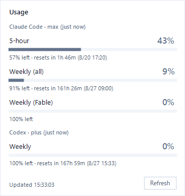

# QuotaGauge

English ・ [日本語](README.ja.md)

A Windows tray app that shows **how much of your Claude Code and Codex quota is left**.

One exe. No installer, no extra .NET runtime.

> **It asks each CLI about its own usage.**
> It never touches your credential files, and nothing is sent to any third party. No setup required.

Made by kimura — [X](https://x.com/kimura_0314) · [note](https://note.com/cozy_auklet6005) · [kimuraのGAS部](https://note.com/cozy_auklet6005/membership) · [Zenn](https://zenn.dev/kimura0314) · [YouTube](https://www.youtube.com/@kimura_1307)

---

## What it does

| Action | |
|---|---|
| **Icon** | Draws the tightest window as a ring. Red above 90%, amber above 70% |
| **Left click** | Opens a panel listing every Claude and Codex window |
| **Hover** | Shows both usage figures |
| **Right click** | Refresh now / which provider the icon follows / Claude data source / log / start with Windows / quit |

The panel:



It refreshes every 3 minutes. Alongside the 5-hour and weekly windows you also get
**per-model weekly windows** and your plan name.

**You can choose which provider the icon follows** from the right-click menu: whichever is
tighter (default), Claude Code only, or Codex only. People lean on different tools.

## Install

1. Download `QuotaGauge.exe` from [Releases](../../releases) and drop it anywhere
   - It is unsigned, so check it against the SHA256 published with the release:
     `Get-FileHash .\QuotaGauge.exe`
2. Double-click it
   - **Because the exe is unsigned, Windows SmartScreen shows "Windows protected your PC".**
     Choose `More info`, then `Run anyway`. If that bothers you, [build it yourself](#build) — it takes seconds
3. **If the icon landed in the `^` overflow, drag it onto the visible part of the taskbar**
   (Windows 11 always puts new tray icons there first)
4. Right click and turn on "start with Windows"

That is the whole setup. As long as `claude` and `codex` are on your PATH and signed in, it works.

## How it works

**Both sides simply ask the CLI what your usage is.** QuotaGauge never reads credentials or calls
an API itself. Each CLI refreshes its own token, so an expired one never stalls the app.

### Claude Code

It starts `claude` in stream-json mode and writes a single control request:

```
{"type":"control_request","request_id":"1","request":{"subtype":"get_usage"}}
```

It reads `kind`, `percent`, `resets_at` and `scope` out of the `rate_limits.limits[]` that come
back. The response also carries `subscription_type`, which becomes part of the panel heading.

This is the same data that Claude Code's own `/usage` shows. **No model is invoked, so nothing is
billed** — measured as `total_cost_usd: 0`, `model_usage: {}`, `total_api_duration_ms: 0`.

> **`get_usage` is an experimental interface.** Claude Code's own schema describes it as
> `Experimental — the response shape may change`, and the SDK method is named
> `usage_EXPERIMENTAL_MAY_CHANGE_DO_NOT_RELY_ON_THIS_API_YET()`.
> It may stop working when that shape changes.

Startup costs **7–10 seconds** (measured; passing empty MCP and hook configs brought that down
from 16.6s). Fetching happens on a background thread, so the UI never blocks.

### Codex

It calls the `codex app-server` JSON-RPC:

```
initialize
account/rateLimits/read
```

That method is **defined in the schema that `codex app-server generate-json-schema` emits**. It
reads `usedPercent`, `resetsAt` and `windowDurationMins` from `rateLimits.primary` and
`secondary`. This side returns in about a second.

> For setups where the Codex CLI carries a telegram plugin, `TELEGRAM_STATE_DIR` is pointed at a
> temporary directory when app-server is invoked, so a poller already running is left alone.

### The Claude data source can be switched

Right click and open the Claude data source menu. **The default is normally what you want.**

| | 1. Ask Claude Code (default) | 2. Call the same endpoint directly | 3. Via the status line |
|---|---|---|---|
| Setup | none | none | **required** (below) |
| Credentials | **untouched** | reads `.credentials.json` | **untouched** |
| Expired token | **refreshed automatically** | **stops with a 401** | unaffected |
| Per-model windows | **yes** | **yes** | no |
| Freshness | **always current** | **always current** | frozen at the last call |
| Cost | 7–10s | one network round trip | just reads a file |
| Terms | asks the CLI | **grey area** (below) | published route only |

**The only reason to pick 2 is speed.** It uses the token in `~/.claude/.credentials.json` to call
`https://api.anthropic.com/api/oauth/usage` directly.

> That is not a published interface. Clause 3 of the
> [Anthropic Consumer Terms](https://www.anthropic.com/legal/consumer-terms) prohibits accessing
> the services through automated or non-human means, whether through a bot, script, or otherwise,
> except via an API key or where otherwise explicitly permitted — and **it is hard to read this
> route as meeting either exception**. Your call.

**There is no longer a reason to pick 3** (1 supersedes it). The status line only runs while you
have Claude Code open in a terminal, so its values go stale. If you want it anyway, add this to
the `statusLine` script in `~/.claude/settings.json`:

```python
# after parsing the incoming JSON into d
try:
    import os, time, json
    rl = d.get('rate_limits')
    if rl:
        p = os.path.join(os.path.expanduser('~'), '.claude', 'quota-cache.json')
        tmp = p + '.tmp'
        f = open(tmp, 'w', encoding='utf-8')
        json.dump({'rate_limits': rl, 'updated_at': int(time.time())}, f)
        f.close()
        os.replace(tmp, p)
except Exception:
    pass
```

### Language

The interface follows your Windows display language: Japanese on a Japanese system, English
everywhere else. To pin it either way, set `language` in `config.json`:

```json
{ "language": "en" }
```

Accepted values are `auto` (the default), `ja` and `en`.

### Where settings and logs live

`config.json` and `quotagauge.log` are written **next to the exe**, so you can carry the whole
thing on a USB stick. Only when that location is not writable (Program Files, say) do they fall
back to `%LOCALAPPDATA%\QuotaGauge\`.

The log is **only written when something fails**. No new lines means fetching is working.

## When something is wrong

| Symptom | |
|---|---|
| `No response from claude` | `claude` is not on your PATH, or you are not signed in. Check that `claude --version` runs |
| `No response from codex app-server` | Same for `codex`. Check that `codex app-server` runs |
| `Sign in to Claude Code again (token expired, HTTP 401)` | Only when using source 2. Source 1 never hits this. While failures continue the interval backs off 3min, 6, 12, up to 60. "Refresh now" retries immediately |
| Claude figures look stale | You are on source 3. Switch back to 1 from the right-click menu |
| No icon in the tray | Windows 11 hides new icons under `^`. Drag it onto the taskbar |

## Build

```powershell
.\build.ps1
```

It uses the `csc.exe` that ships with Windows, so no Visual Studio and no .NET SDK.
`app.ico` is regenerated by `tools/make-icon.ps1` when missing — it runs the same drawing code the
tray icon uses, so the two never drift apart.

> Save `QuotaGauge.cs` as **UTF-8 with BOM** (`build.ps1` fixes this for you).

## Requirements

- Windows 10 / 11
- .NET Framework 4.x (ships with Windows)
- `claude` and `codex` on your PATH and signed in — either one alone is fine, whichever is present
  shows up
- No administrator rights

## Acknowledgements

QuotaGauge exists because of **[CodexBar](https://github.com/steipete/CodexBar)** by
[@steipete](https://github.com/steipete) (MIT). That is the tool that showed me a quota readout
belongs in the menu bar, and it covers far more ground than this does — 57+ providers, incident
badges, a real settings surface.

CodexBar runs on macOS and Linux. I am on Windows, so I could not use it. QuotaGauge is what I
built instead: a much smaller thing, written in C# rather than Swift, sharing no code with it. The
default data path ended up different too — QuotaGauge asks `claude` for `get_usage` instead of
calling the API itself.

If you are on a Mac, install CodexBar. It does more than this ever will.

## Author

kimura — [X](https://x.com/kimura_0314) · [note](https://note.com/cozy_auklet6005) · [kimuraのGAS部 (membership)](https://note.com/cozy_auklet6005/membership) · [Zenn](https://zenn.dev/kimura0314) · [YouTube](https://www.youtube.com/@kimura_1307)

I build small tools around Google Apps Script and write about them.

## Disclaimer

This project is unofficial and is not affiliated with Anthropic or OpenAI.

The figures are whatever each tool reports, shown as-is. Accuracy and timeliness are not
guaranteed. Do not use them as a basis for billing or contractual claims.

Interfaces and value formats may change without notice.

## License

[MIT](LICENSE)
